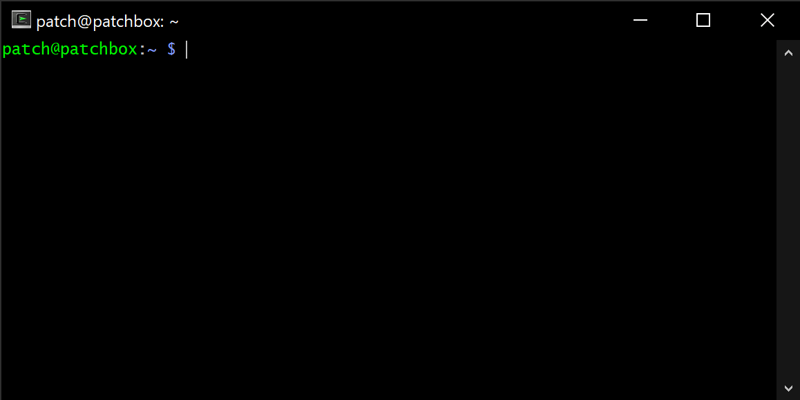

# ALSA Mixer



ALSA (Advanced Linux Sound Architecture) provides several tools for controlling audio settings on the Pisound Micro. This document explains how to use them for adjusting volume levels, inputs, outputs, and other sound card parameters.

*Note*: The `pisound-micro-common` Debian package must be installed to use these tools. If you followed [Initial Software Setup](getting-started.md#initial-software-setup), this package should already be installed.

## Using alsamixer

`alsamixer` is a graphical mixer program that runs in the terminal. It allows you to control all the audio features of your sound card:

1. Open a terminal and run:
    ```
    alsamixer
    ```

2. Press **F6** to select the sound card - choose **pisoundmicro** from the list.

3. Navigate with arrow keys:
    - Left/right arrows to select controls
    - Up/down arrows to adjust values
    - 'M' key to mute/unmute channels

4. Press **Esc** to exit when finished.

5. Press **F1** for more help.

The Pisound Micro has several controls including Master volume, Capture (recording) levels, and other parameters specific to its functionality.

## Using amixer

`amixer` is a command-line mixer for ALSA sound card driver. It's useful for scripts or when you need to make quick adjustments without a graphical interface.

Examples:

```bash
# List all controls for Pisound Micro
amixer -c pisoundmicro scontrols

# Get information about headphone output
amixer -c pisoundmicro get Headphone

# Set headphone volume to 80%
amixer -c pisoundmicro set Headphone 80%

# Adjust line output volume
amixer -c pisoundmicro set Lineout 75%

# Enable microphone bias (for condenser mics)
amixer -c pisoundmicro set MicBias on

# Configure capture (recording) volume
amixer -c pisoundmicro set Capture 85%

# Boost input gain for quiet sources
amixer -c pisoundmicro set 'PGA Boost' on

# Set digital volume
amixer -c pisoundmicro set Digital 90%

# Switch between stereo and mono output modes
amixer -c pisoundmicro set 'DAC Mono-Stereo-Mode' Stereo

# Enable aux input
amixer -c pisoundmicro set Aux on
```

You can also use these commands in scripts to automate audio configurations for different scenarios.

## Essential ALSA Controls for Pisound Micro

Here are the essential ALSA controls that must be unmuted and activated in order to get audio output and input.

### Minimum Controls for Audio Output

```bash
# Enable DAC output and set volume
amixer -c pisoundmicro set Digital 80%
amixer -c pisoundmicro set Headphone 75%
amixer -c pisoundmicro set Lineout 75%

# Unmute outputs
amixer -c pisoundmicro set Headphone unmute
amixer -c pisoundmicro set Lineout unmute

# Configure DAC routing (required for sound to reach outputs)
amixer -c pisoundmicro set 'Left Playback Mixer Left DAC' on
amixer -c pisoundmicro set 'Right Playback Mixer Right DAC' on
```

### Minimum Controls for Audio Input

```bash
# Enable capture and set recording level
amixer -c pisoundmicro set Digital 80%
amixer -c pisoundmicro set Capture 80%
amixer -c pisoundmicro set Aux -- -3dB

# For Line input signals
amixer -c pisoundmicro set 'PGA Boost' on
```

## Using alsactl

`alsactl` is used for saving and restoring the state of the sound card mixer. This is particularly useful for preserving your mixer settings between reboots or for switching between different configurations.

### Storing Current Settings

To save the current mixer settings to a file:

```bash
alsactl store -f example.state pisoundmicro
```

This command saves all current mixer settings to `example.state`.

### Restoring Settings

To restore settings from a previously saved file:

```bash
alsactl restore -f example.state pisoundmicro
```

### Initializing Default Settings

To reset Pisound Micro to sensible default settings:

```bash
alsactl init pisoundmicro
```

This command initializes the sound card with factory default settings, which provides a good starting point if you've made unwanted changes.

### System-Wide Settings

You can also store ALSA mixer settings system-wide, which will be applied automatically each time the system boots:

```bash
# Configure your Pisound Micro settings as desired
# Then save them system-wide
sudo alsactl store
```

This saves the settings to `/var/lib/alsa/asound.state` where they will be loaded automatically during system startup.

To manually restore system-wide settings:

```bash
sudo alsactl restore
```
