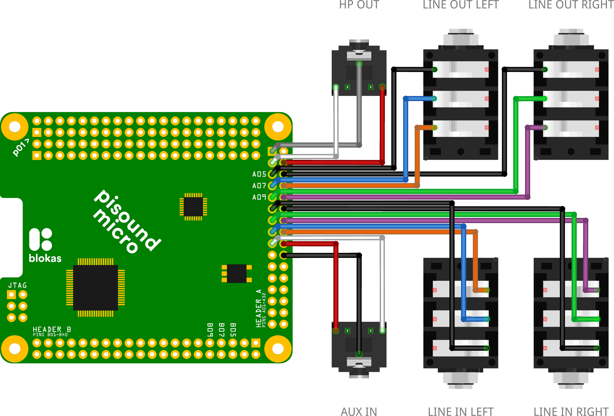

# Audio Connections

The Pisound Micro provides flexible audio connectivity options through its ADAU1961 codec. This page explains how to configure and connect audio inputs and outputs to meet your specific requirements.

## Overview

Pisound Micro features multiple audio connection options that can be configured both physically and through software. Understanding these options will help you get the most out of your device.

## Summary of Pin Usage



| Pin | Default Function         | Alternate Function        |
|-----|--------------------------|---------------------------|
| A01 | VGND (Headphone Virtual Ground) | MONOOUT (Line Level) |
| A03 | HPL (Headphone Left)     | -                         |
| A04 | HPR (Headphone Right)    | -                         |
| A07 | LINE_OUT_L- (Output)     | -                         |
| A08 | LINE_OUT_L+ (Output)     | Single-Ended Output Left  |
| A09 | LINE_OUT_R- (Output)     | -                         |
| A10 | LINE_OUT_R+ (Output)     | Single-Ended Output Right |
| A13 | LINE_IN_R- (Input)       | Single-Ended Input 3      |
| A14 | LINE_IN_R+ (Input)       | Single-Ended Input 4      |
| A15 | LINE_IN_L- (Input)       | Single-Ended Input 1      |
| A16 | LINE_IN_L+ (Input)       | Single-Ended Input 2      |

AGND (Analog Ground) for audio is available on these pins: A02, A05, A06, A11, A12, A19 and A20.

## Connection Options at a Glance

Pisound Micro supports three main types of audio connections, each with multiple configuration options:

- **Headphone Output**: 
    - Capless configuration (default) - Direct headphone connections
    - External capacitor configuration - For connecting to other audio equipment
    - Line output configuration - Alternative line output option (external capacitor needed)

- **Line Input**:
    - Differential input - Balanced stereo channels with superior noise immunity
    - Single-ended input - Four independent mono inputs

- **Line Output**:
    - Differential output - Balanced output for professional applications
    - Single-ended output - Standard unbalanced stereo output

The following sections provide detailed information about each configuration option.

## Headphone Output Configurations

Pisound Micro offers three different configurations for the headphone output pins, allowing you to adapt to various audio connection scenarios.

### Capless Headphone Configuration (Default)

In the default configuration, the HPL (A03) and HPR (A04) pins provide stereo headphone output, while the VGND (A01) pin serves as a virtual ground. This eliminates the need for coupling capacitors and is ideal for most headphone applications.

#### Wiring

- **HPL (A03)**: Left channel
- **HPR (A04)**: Right channel
- **VGND (A01)**: Virtual ground

#### Important Note

This configuration is suitable **only for headphone connections**. Do not use it to interconnect with other audio electronics (amplifiers, mixers, etc.) as the virtual ground system is incompatible with common ground devices. Improper connections can create ground loops, causing noise or potential damage.

**For connecting to other audio equipment**: Use the [External Capacitor Configuration](#external-capacitor-configuration) instead, which provides proper electrical isolation and prevents ground loops.

#### Safety Feature

Pisound Micro includes automatic protection that mutes the capless headphone output if a ground loop is detected, protecting both the device and your connected equipment.

### External Capacitor Configuration

For connecting to external audio equipment, this configuration uses coupling capacitors with the HPL and HPR pins. This approach electrically isolates the Pisound Micro from other devices and allows the A01 pin to be repurposed as a line level MONOOUT.

#### Wiring

- **HPL (A03)**: Left channel (via coupling capacitor)
- **HPR (A04)**: Right channel (via coupling capacitor)
- **A01 (Optional)**: MONOOUT line level mono output (can be left unconnected if unused)

#### Selecting Capacitors

When choosing capacitors:

- **Capacitance Range**: 220µF–470µF recommended
- **Type**: Electrolytic capacitors (observe correct polarity)
- **Voltage Rating**: 6V minimum, up to 25V recommended
- **Frequency Response**: Capacitor forms a high-pass filter with headphone impedance
- **Cutoff Frequency Formula**:

    f = 1/(2π × R × C)

    Where:

    - f is the cutoff frequency in Hz
    - π is 3.14159265358979323846264338...
    - R is the headphone impedance in ohms
    - C is the capacitance in farads

| Impedance           | Minimum Recommended Capacitance | Expected -3dB Cutoff Point |
|---------------------|---------------------------------|----------------------------|
| 16Ω                 | 330µF                           | 30 Hz                      |
| 32Ω                 | 220µF                           | 23 Hz                      |
| 64Ω+                | 100µF                           | 25 Hz                      |
| 1kΩ                 | 8µF                             | 20 Hz                      |

For most applications, 220µF capacitors provide an excellent balance between performance, size, and cost.


### Line Output Configuration

The headphone pins can alternatively function as an additional line output for connecting to external amplifiers or audio equipment.

#### Wiring

- **HPL (A03)**: Line output left channel
- **HPR (A04)**: Line output right channel
- **AGND**: Ground reference (use audio ground, not VGND)

#### Configuration:

This mode requires adjusting codec settings through ALSA mixer controls:

1. Reduce the output level to line-level standards
2. Disable headphone-specific processing
3. Connect to line-level inputs on external equipment

This configuration provides additional output options when you need more than the dedicated line outputs.

## Line Input Configurations

The line input pins can be configured in two different ways:

### Differential Line Input

The differential configuration uses:

- **A15 & A16**: Differential Left channel (LINE_IN_L- and LINE_IN_L+)
- **A13 & A14**: Differential Right channel (LINE_IN_R- and LINE_IN_R+)

This balanced input configuration provides superior noise immunity and is ideal for professional audio connections or noisy environments.

### Single-Ended Line Input

Alternatively, you can configure these pins as four separate single-ended inputs:

- **A15**: Single-Ended Input 1 (LINE_IN_L-)
- **A16**: Single-Ended Input 2 (LINE_IN_L+)
- **A13**: Single-Ended Input 3 (LINE_IN_R-)
- **A14**: Single-Ended Input 4 (LINE_IN_R+)

This allows connecting up to four mono audio sources simultaneously.

*Note*: When using single-ended inputs, properly terminate any unused inputs to prevent noise.

## Line Output Configurations

Pisound Micro's line output pins support both differential and single-ended modes:

### Differential Line Output

Professional balanced output using:

- **A07 & A08**: Differential Left (LINE_OUT_L- and LINE_OUT_L+)
- **A09 & A10**: Differential Right (LINE_OUT_R- and LINE_OUT_R+)

This configuration offers the best noise rejection for professional applications.

### Single-Ended Line Output

Standard unbalanced stereo output:

- **A08**: Left channel (LINE_OUT_L+)
- **A10**: Right channel (LINE_OUT_R+)
- **AGND**: Ground reference

This configuration is compatible with most consumer audio equipment.

## Software Configuration

All audio configurations can be controlled through Device Tree overlay parameters in `/boot/firmware/config.txt`, allowing you to switch between modes without physical rewiring.

### Configuration Parameters

| Parameter     | Values                                           | Description                    |
|---------------|--------------------------------------------------|--------------------------------|
| `input-mode`  | **differential**, single-ended                   | Line input configuration       |
| `hp-out-mode` | **capless-headphone**, headphone, line-out       | Headphone output configuration |
| `line-out`    | **line-out**, headphone                          | Line output configuration      |

*Note*: Default values are marked in **bold**. The line output path includes 100μF capacitors on the board.

### Setting Parameters

Add or modify parameters in `/boot/firmware/config.txt`:

```
dtoverlay=pisound-micro,hp-out-mode=headphone,input-mode=single-ended
```

Parameters can be combined as needed or omitted to use defaults.

### Common Configuration Examples

1. **Default Configuration**:
   ```
   dtoverlay=pisound-micro
   ```
   Uses capless headphone output, differential inputs, and standard line outputs.

2. **Isolated Headphone Output and Multiple Input Sources**:
   ```
   dtoverlay=pisound-micro,hp-out-mode=headphone,input-mode=single-ended
   ```
   Sets up headphone output with external capacitors for isolation and four single-ended inputs while keeping default line output settings.
3. **Additional Line Output**:
   ```
   dtoverlay=pisound-micro,hp-out-mode=line-out
   ```
   Repurposes the headphone output as an additional line output.

After changing parameters, restart your Raspberry Pi for the changes to take effect.
