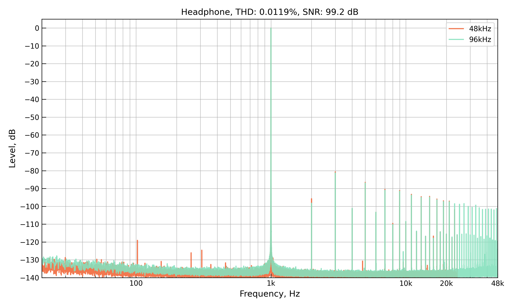
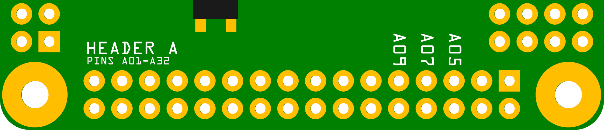

# Detailed Specifications

## General

Pisound Micro follows the Raspberry Pi's Hardware Attached on Top (HAT) form factor.

| Parameter               | Value                              |
| ----------------------- | ---------------------------------- |
| MIDI I/O                | 1 Input, 1 Output                  |
| MIDI Activity           | Can be indicated on any GPIO       |
| MIDI Loopback Latency   | 1.4ms                              |
| Minimum I²C Baud Rate   | 100kHz                             |
| Maximum I²C Baud Rate   | 400kHz                             |
| Number of GPIOs         | 37                                 |
| EXTINT Pins             | 16                                 |
| ADC Pins                | 12                                 |
| ADC Resolution          | 10 bits, value range 0 - 1023      |
| GPIO Loopback Latency   | 0.5ms                              |
| GPIO Microcontroller    | Microchip [ATSAMD21J18](https://www.microchip.com/en-us/product/atsamd21j18){target=_blank} |
| Current Draw            | 25 ~ 35 mA @ 5.1V DC               |
| Dimensions              | 56mm x 65mm x 4mm                  |
| Weight                  | 13g                                |


## Mechanical Drawing

The mechanical drawing provides a detailed overview of the Pisound Micro's physical dimensions and layout, enabling the creation of custom daughter or motherboards for use with Pisound Micro or supporting the general physical layout of a product incorporating a Pisound Micro.

All dimensions in the drawing are specified in millimeters. R1 and R3 refer to corner rounding using 1mm and 3mm radius respectively.


Also available as a [PDF](images/Pisound_Micro_Mechanical_Drawing.pdf){target=_blank}.

## Supported Raspberry Pi Models

| **Compatible Models** |  |
| ----- | ----- |
| Raspberry Pi 5 | Raspberry Pi 4B |
| Raspberry Pi 3B | Raspberry Pi 3B+ |
| Other Models[^1] | |

[^1]:
    Not recommended for new audio based projects due to lesser processing power, but Pisound Micro can also be used with Raspberry Pi's 2, Zero, Zero W and Zero 2 W as well as the A models.

///Footnotes Go Here///


## Audio

| Parameter               | Value                              |
| ----------------------- | ---------------------------------- |
| Audio Channels          | 2                                  |
| Audio CODEC             | Analog Devices [ADAU1961](https://www.analog.com/media/en/technical-documentation/data-sheets/adau1961.pdf){target=_blank} |
| Audio Input Pins        | 6 input pins - 2 in single ended mode, remaining configurable as 4 pins in single ended mode or 2 differential pairs |
| Audio Output Pins       | 2 single ended pins and 2 differential pairs (can be used in single ended mode), 1 mono output pin |
| Audio Output Impedance  | Line out (10kΩ) or Headphone (16Ω - 32Ω)          |
| Line Out Capacitance    | 100µF                                             |
| Line Input Gain         | Up to 35.25dB gain, additional +20dB boost option |
| AUX Input Gain          | Up to 6dB                                         |
| SNR                     | > 98dB                                            |
| THD                     | < 0.02%                                           |
| THD+N                   | < -90dB                                           |
| Sampling Rates          | From 8kHz to 96kHz                                |

### Frequency Response

=== "Headphone"

    

=== "Capless Headphone"

    

=== "Line"

    

### THD

=== "Headphone"

    

=== "Capless Headphone"

    

=== "Line"

    

## MIDI

There's 2 pins for MIDI output and 2 pins for MIDI input, with MIDI standard compliant opto-isolated circuit behind them. The only thing that remains to be connected is MIDI ports of your choice, see [Header A](#32-pin-header-a) for details.

On average, the roundtrip latency, which is the measure of a 3 byte Note On message going from software through ALSA sequencer, the driver, firmware to physical data output and back all the way to the receiving port, the firmware, the driver, the ALSA sequencer and the software program is around 1.45ms. More detailed test results by alsa-midi-latency-test program:

??? "MIDI Latency Test Results"

    ```
    patch@patchbox:~ $ alsa-midi-latency-test -i pisoundmicro:0 -o pisoundmicro:0 -1
    > alsa-midi-latency-test 0.0.5
    > running on Linux release 6.12.19-v8-16k+ (version #1865 SMP PREEMPT Wed Mar 19 13:48:20 GMT 2025) on aarch64
    > clock resolution: 0.000000001 s
    
    > sampling 10000 midi latency values - please wait ...
    > press Ctrl+C to abort test
    
    sample; latency_ms; latency_ms_worst
         0;      1.511;      1.511
      3586;      1.530;      1.530
      9999;      1.440;      1.530
    > done.
    
    > latency distribution:
    ...
      1.4 -  1.5 ms:     9732 ##################################################
      1.5 -  1.6 ms:      268 #
    
    > SUCCESS
    
     best latency was 1.4 ms
     mean latency was 1.4 ms
     worst latency was 1.5 ms, which is great.
    ```

## GPIO

Pisound Micro has 37 GPIO pins, operating in 3.3V power domain, with one set of them particularly suited for reading Quadrature Encoders (16 pins, can connect up to 8 encoders), and another set (12 pins, 12 analog readings) for reading analog inputs such as potentiometers.

## Pinouts

The first pins of the headers are marked with square pads. Pisound Micro comes with no headers pre-installed, to offer complete freedom for integration into your projects.

### Raspberry Pi 40-Pin GPIO Header


By far the best reference on the Raspberry Pi pin header is [https://pinout.xyz/](https://pinout.xyz/){target=_blank}. In case of absent Internet connectivity, run `pinout`. On Pisound Micro, all of the 40 pins are duplicated in a parallel location, for convenient access.

??? "The Pins Used by Pisound Micro:"

    |               |               |
    | ------------- | ------------- |
    | 1. 3.3V Power | 2. 5V Power   |
    | 3. SDA        | 4. 5V Power   |
    | 5. SCL        | 6. GND        |
    | 7. ...        | 8. ...        |
    | 9. GND        | 10. ...       |
    | 11. ...       | 12. *PCM CLK  |
    | 13. ...       | 14. GND       |
    | 15. ...       | 16. ...       |
    | 17. 3.3V Power| 18. ...       |
    | 19. ...       | 20. GND       |
    | 21. ...       | 22. ...       |
    | 23. ...       | 24. ...       |
    | 25. GND       | 26. ...       |
    | 27. ...       | 28. ...       |
    | 29. ...       | 30. GND       |
    | 31. ...       | 32. ...       |
    | 33. ...       | 34. GND       |
    | 35. *PCM FS   | 36. *GPIO16   |
    | 37. *GPIO 26  | 38. *PCM DIN  |
    | 39. GND       | 40. *PCM DOUT |

Pins marked with a \* are exclusively used by Pisound Micro and can't be shared with other boards. The rest of the pins can be shared. For making use of I²C, make sure to use speeds of up to or equal to 400kHz and avoid 0x12 and 0x3b 7-bit addresses.

### 32-Pin Header A



This header hosts mostly analog audio and MIDI pins, also 6 GPIO pins.

??? "Header A Pinout:"

    |                        |                         |
    | ---------------------- | ----------------------- |
    | 1. MONOOUT/VGND        | 2. AGND                 |
    | 3. HP_OUT_L            | 4. HP_OUT_R             |
    | 5. AGND                | 6. AGND                 |
    | 7. LINE_OUT_L-         | 8. LINE_OUT_L+          |
    | 9. LINE_OUT_R-         | 10. LINE_OUT_R+         |
    | 11. AGND               | 12. AGND                |
    | 13. LINE_IN_R-         | 14. LINE_IN_R+          |
    | 15. LINE_IN_L-         | 16. LINE_IN_L+          |
    | 17. AUX_IN_L           | 18. AUX_IN_R            |
    | 19. AGND               | 20. AGND                |
    | 21. MIDI In Sink (5)   | 22. MIDI In Source (4)  |
    | 23. MIDI Out Sink (5)  | 24. MIDI Out Source (4) |
    | 25. GND                | 26. GND                 |
    | 27. A27 (GPIO)         | 28. A28 (GPIO)          |
    | 29. A29 (GPIO)         | 30. A30 (GPIO)          |
    | 31. A31 (GPIO)         | 32. A32 (GPIO)          |

The number in brackets of MIDI pins indicate which DIN-5 pin should be connected. For MIDI output, make sure to connect DIN-5 pin 2 to GND. For minijack MIDI ports, refer to [https://minimidi.world/](https://minimidi.world/){target=_blank}. (Our products use TRS Type A)

### 40-Pin Header B


This header provides 31 GPIO pins, including two specialized groups: one with 16 pins designed for connecting up to 8 encoders, and another with 12 10-bit ADC pins ideal for potentiometers. Additionally, all GPIO pins can function as general-purpose digital input/output pins.

??? "Header B Pinout:"

    |                   |                   |
    | ----------------- | ----------------- |
    | 1. +3.3V Power    | 2. GND            |
    | 3. B03 (Encoder)  | 4. B04 (Encoder)  |
    | 5. B05 (Encoder)  | 6. B06 (Encoder)  |
    | 7. B07 (Encoder)  | 8. B08 (Encoder)  |
    | 9. B09 (Encoder)  | 10. B10 (Encoder) |
    | 11. B11 (Encoder) | 12. B12 (Encoder) |
    | 13. B13 (Encoder) | 14. B14 (Encoder) |
    | 15. B15 (Encoder) | 16. B16 (Encoder) |
    | 17. B17 (Encoder) | 18. B18 (Encoder) |
    | 19. +3.3V Power   | 20. GND           |
    | 21. AVDD          | 22. GND           |
    | 23. B23 (ADC)     | 24. B24 (ADC)     |
    | 25. B25 (ADC)     | 26. B26 (ADC)     |
    | 27. B27 (ADC)     | 28. B28 (ADC)     |
    | 29. B29 (ADC)     | 30. B30 (ADC)     |
    | 31. B31 (ADC)     | 32. B32 (ADC)     |
    | 33. B33 (ADC)     | 34. B34 (ADC)     |
    | 35. AVDD          | 36. GND           |
    | 37. B37 (GPIO)    | 38. B38 (GPIO)    |
    | 39. B39 (GPIO)    | 40. GND           |

Pins in Encoder and ADC groups can be used as digital I/O as well. Encoder pins are best suited for use with Encoders, as they have a dedicated hardware interrupt upon signal level changes on the Pisound Micro's microcontroller. That makes them suitable for detection of digital signal edges when used as GPIOs too. Encoders may be connected to the rest of the GPIO pins as well, but they may not be as snappy.

AVDD is the filtered analog 3.3V power supply, prefer to use it as the positive terminal for your analog potentiometer voltage divider circuits.
