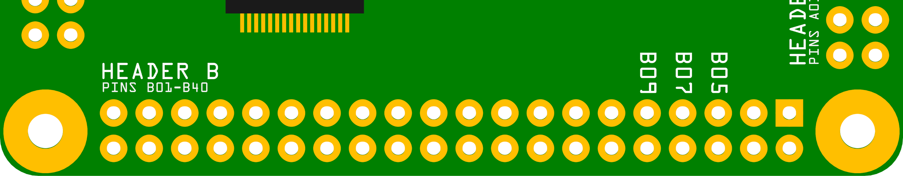

# Detailed Specifications

## Audio

## MIDI

There's 2 pins for MIDI output and 2 pins for MIDI input, with MIDI standard compliant opto-isolated circuit behind them. The only thing that remains to be connected is MIDI ports of your choice, see [Header A](#32-pin-header-a) for details.

Latency: todo

## GPIO

Pisound Micro has 37 GPIO pins, operating in 3.3V power domain, with one set of them particularly suited for reading Quadrature Encoders (16 pins, can connect up to 8 encoders), and another set (12 pins, 12 analog readings) for reading analog inputs such as potentiometers.

## Pinouts

The first pins of the headers are marked with square pads. Pisound Micro comes with no headers pre-installed, to offer complete freedom for integration into your projects.

### Raspberry Pi 40-Pin GPIO Header

By far the best reference on the Raspberry Pi pin header is [https://pinout.xyz/](https://pinout.xyz/){target=_blank}. In case of absent Internet connectivity, run `pinout`. On Pisound Micro, all of the 40 pins are duplicated in a parallel location, for convenient access.

??? "The Pins Used by Pisound Micro:"

    |               |               |
    | ------------- | ------------- |
    | 1. 3.3V Power | 2. 5V Power   |
    | 3. SDA        | 4. 5V Power   |
    | 5. SCL        | 6. GND        |
    | 7. ...        | 8. ...        |
    | 9. GND        | 10. ...       |
    | 11. ...       | 12. *PCM CLK  |
    | 13. ...       | 14. GND       |
    | 15. ...       | 16. ...       |
    | 17. 3.3V Power| 18. ...       |
    | 19. ...       | 20. GND       |
    | 21. ...       | 22. ...       |
    | 23. ...       | 24. ...       |
    | 25. GND       | 26. ...       |
    | 27. ...       | 28. ...       |
    | 29. ...       | 30. GND       |
    | 31. ...       | 32. ...       |
    | 33. ...       | 34. GND       |
    | 35. *PCM FS   | 36. *GPIO16   |
    | 37. *GPIO 26  | 38. *PCM DIN  |
    | 39. GND       | 40. *PCM DOUT |

Pins marked with a \* are exclusively used by Pisound Micro and can't be shared with other boards. The rest of the pins can be shared. For making use of I²C, make sure to use speeds of up to or equal to 400kHz and avoid 0x12 and 0x3b 7-bit addresses.

### 32-Pin Header A

This header hosts mostly analog audio and MIDI pins, also 6 GPIO pins.

??? "Header A Pinout:"

    |                        |                         |
    | ---------------------- | ----------------------- |
    | 1. AGND                | 2. AGND                 |
    | 3. HP_OUT_L            | 4. HP_OUT_R             |
    | 5. AGND                | 6. AGND                 |
    | 7. LINE_OUT_L-         | 8. LINE_OUT_R-          |
    | 9. LINE_OUT_L+         | 10. LINE_OUT_R+         |
    | 11. AGND               | 12. AGND                |
    | 13. LINE_IN_L-         | 14. LINE_IN_R-          |
    | 15. LINE_IN_L+         | 16. LINE_IN_R+          |
    | 17. AUX_IN_L           | 18. AUX_IN_R            |
    | 19. GND                | 20. GND                 |
    | 21. MIDI In Sink (5)   | 22. MIDI Out Source (5) |
    | 23. MIDI In Source (4) | 24. MIDI Out Sink (4)   |
    | 25. GND                | 26. GND                 |
    | 27. A27 (GPIO)         | 28. A28 (GPIO)          |
    | 29. A29 (GPIO)         | 30. A30 (GPIO)          |
    | 31. A31 (GPIO)         | 32. A32 (GPIO)          |

The number in brackets of MIDI pins indicate which DIN-5 pin should be connected. For MIDI output, make sure to connect DIN-5 pin 2 to the output. For minijack MIDI ports, refer to [https://minimidi.world/](https://minimidi.world/){target=_blank}. (Our products use TRS Type A)

### 40-Pin Header B

This header hosts 31 GPIO pins, with 2 specialized sets, one for encoders (16 pins, up to 8 encoders can be connected) as well as 12 10-bit ADC pins for hooking up potentiometers. All of the GPIO pins may serve as simple digital input/output pins as well.

??? "Header B Pinout:"

    |                   |                   |
    | ----------------- | ----------------- |
    | 1. +3.3V Power    | 2. GND            |
    | 3. A03 (Encoder)  | 4. A04 (Encoder)  |
    | 5. A05 (Encoder)  | 6. A06 (Encoder)  |
    | 7. A07 (Encoder)  | 8. A08 (Encoder)  |
    | 9. A09 (Encoder)  | 10. A10 (Encoder) |
    | 11. A11 (Encoder) | 12. A12 (Encoder) |
    | 13. A13 (Encoder) | 14. A14 (Encoder) |
    | 15. A15 (Encoder) | 16. A16 (Encoder) |
    | 17. A18 (Encoder) | 18. A18 (Encoder) |
    | 19. +3.3V Power   | 20. GND           |
    | 21. AVDD          | 22. GND           |
    | 23. A23 (ADC)     | 24. A24 (ADC)     |
    | 25. A25 (ADC)     | 26. A26 (ADC)     |
    | 27. A27 (ADC)     | 28. A28 (ADC)     |
    | 29. A29 (ADC)     | 30. A30 (ADC)     |
    | 31. A31 (ADC)     | 32. A32 (ADC)     |
    | 33. A33 (ADC)     | 34. A34 (ADC)     |
    | 35. AVDD          | 36. GND           |
    | 37. A37 (GPIO)    | 38. A38 (GPIO)    |
    | 39. A39 (GPIO)    | 40. GND           |

Pins in Encoder and ADC groups can be used as digital I/O as well. Encoder pins are best suited for use with Encoders, as they have a dedicated hardware interrupt upon signal level changes on the Pisound Micro's microcontroller. That makes them suitable for detection of digital signal edges when used as GPIOs too. Encoders may be connected to the rest of the GPIO pins as well, but they may not be as snappy.

AVDD is the filtered analog 3.3V power supply, prefer to use it as the positive terminal for your analog potentiometer voltage divider circuits.

## Supported Raspberry Pi Models

