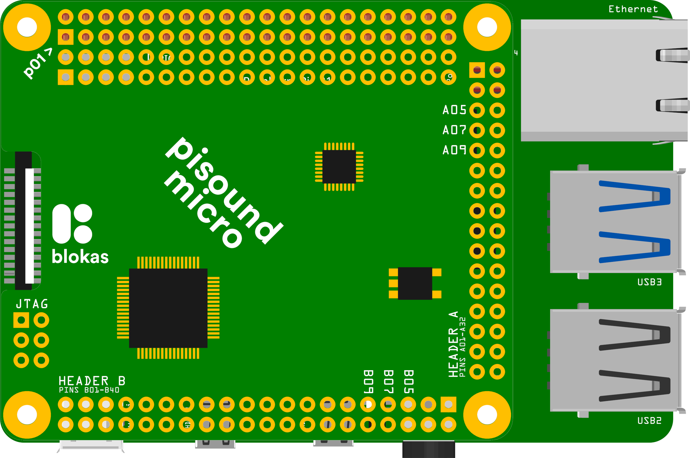
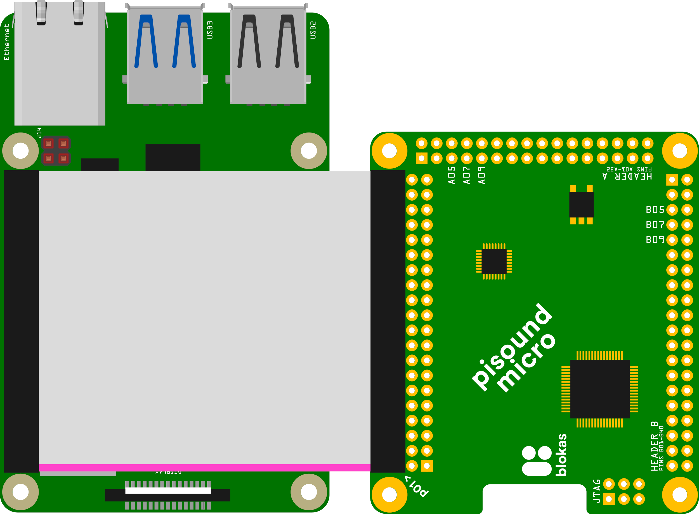

# Getting Started

## Hardware Setup

The Pisound Micro comes with no header or audio / MIDI connectors pre-soldered, offering maximum flexibility for your project's layout. Whatever way you decide to go is entirely up to you, but we'll share some basic connection schemes to get you going.

### Hooking up to Raspberry Pi

In order to use Pisound Micro with Raspberry Pi, either all (or a minimal actually used set) of the Raspberry Pi GPIO header pins must make contact between the boards. The pins map one-to-one, meaning that each `rpi>` GPIO pin on Pisound Micro must be connected to the corresponding GPIO pin on the Raspberry Pi. For example, pin 1 on Pisound Micro should be connected to pin 1 on the Raspberry Pi, pin 2 to pin 2, and so on, up to pin 40.

The square hole indicates the very first pin. The pin numbering matches the numbering at [pinout.xyz](https://pinout.xyz){target=_blank}

After making the connections and before powering on, always doublecheck with a multimeter in beep mode whether there's no unexpected connections.

#### Mounting on Top

For mounting Pisound Micro directly on top of the Raspberry Pi, you'll want to use a 2x20 female pin header with 2.54mm (0.1") pitch. You may find 40 pin headers with pins of different lengths (todo: link į toby / digikey?), ones with long pins are useful for stacking something on top or making additional connections using female cable jumpers or soldering directly to the protruding pins. You may use headers with short pin length too, as the entire 40 pin GPIO header is duplicated alongside for easy access to the Raspberry Pi GPIOs.



The recommended way of soldering the female pin header is to insert it from the bottom side of Pisound Micro (the bottom side is the one without any electronic components) to the holes marked with `rpi>`, first solder a corner pin, then inspect the header alignment. If any adjustment is needed, reheat the solder, move the header into the correct position, and hold it there until the solder cools down and stiffens back again. Then solder a diagonal corner pin, so the header is secured in a stable position. Continue soldering every pin. If you think you're spending too much time on a single pin, you may want to skip a few pins forward for soldering and come back to the previous location, to avoid overheating the area.

#### Ribbon Cable Connection

Another option is to make the connection using a 40 way ribbon cable, connecting each of the 40 GPIO header contacts between the boards. You can acquire cable assemblies with IDC headers preinstalled at certain lengths, or you may even opt to assemble your own cable by cutting the required length of ribbon cable and installing the IDC connectors yourself. Pay attention to the pink line (or otherwise identify your first wire) and the little marking of the first contact on the IDC connector, to ensure all of the connectors are installed the right way. If using a connector, you'll want to install a 2x20 male pin header with 2.54mm (0.1") pitch. The same soldering tips from above section apply here as well, except the header must be inserted from the top side (the one with all the components).



If you'd like, you may decide to solder the ribbon cable's wires directly into the holes without any header.

Before powering on, it's always a good idea to doublecheck the header pins between the boards whether the connections take place between the expected contacts.

#### Wire Connection

You may even connect the boards up using regular wires soldered directly into the contact holes or install a header to your liking for use with cable jumpers to link the boards together.

??? "The Pins That Must Be Connected Together"

    <br/>All of the named pins must be hooked up at matching positions between the boards.

    |               |              |
    | ------------- | ------------ |
    | 1. 3.3V Power | 2. 5V Power  |
    | 3. SDA        | 4. 5V Power  |
    | 5. SCL        | 6. GND       |
    | 7. ...        | 8. ...       |
    | 9. GND        | 10. ...      |
    | 11. ...       | 12. PCM CLK  |
    | 13. ...       | 14. GND      |
    | 15. ...       | 16. ...      |
    | 17. 3.3V Power| 18. ...      |
    | 19. ...       | 20. GND      |
    | 21. ...       | 22. ...      |
    | 23. ...       | 24. ...      |
    | 25. GND       | 26. ...      |
    | 27. ...       | 28. ...      |
    | 29. ...       | 30. GND      |
    | 31. ...       | 32. ...      |
    | 33. ...       | 34. GND      |
    | 35. PCM FS    | 36. GPIO16   |
    | 37. GPIO 26   | 38. PCM DIN  |
    | 39. GND       | 40. PCM DOUT |

In case the signal name matches on multiple pins (3.3V Power, 5V Power, GND), you may hook the pin holes to a single carrier cable, and split it out at the other end. Recommended wire gauge is around 26 AWG. Strive for equal and as short as possible cable length, especially for orange and blue wire groups.


#### Custom PCB

To build a custom PCB that hosts a Pisound Micro, refer to this mechanical drawing (todo) showcasing the key elements, their positions and dimensions - the outline of the board, the mounting holes, and the headers.

### Wiring Connectors

#### Audio

The bellow schematic shows how to hook up audio jacks to Pisound Micro's A header. You may hook up only the connectors you plan to use. If you use connectors for input with normally closed contacts, connect AGND to the closed state pins.


**Wire color legend:**

<div class="desktop-display" markdown="1">

| <span style="color: black;">Black</span> | <span style="color: grey;">White</span> | <span style="color: Red;">Red</span> | <span style="color: blue;">Blue</span> | <span style="color: orange;">Orange</span> | <span style="color: green;">Green</span> | <span style="color: purple;">Purple</span> |
| ----- | ----- | --- | ---- | ------ | ----- | ------ |
| AGND | Left Ch. | Right Ch. | Diff. Left- | Diff. Left+ | Diff. Right- | Diff. Right+ |
| **Output pins:** | A03 | A04 | A07 | A09 | A08 | A10 |
| **Input pins:** | A17 | A18 | A11 | A13 | A12 | A14 |

</div>

<div class="mobile-display" markdown="1">

| <span style="color: black;">Black</span> | <span style="color: grey;">White</span> | <span style="color: Red;">Red</span> | <span style="color: blue;">Blue</span> |
| ----- | ----- | --- | ---- |
| AGND | Left Ch., Out: A03, In: A17 | Right Ch., Out: A04, In: A18 | Diff. Left-, Out: A07, In: A11 |
| <span style="color: orange; font-weight: bold;">Orange</span> | <span style="color: green; font-weight: bold;">Green</span> | <span style="color: purple; font-weight: bold;">Purple</span> | &nbsp; |
| Diff. Left+, Out: A09, In: A13 | Diff. Right-, Out: A08, In: A13 | Diff. Right+, Out: A10, In: A14 | &nbsp; |

</div>

#### MIDI

You may opt to use DIN-5 MIDI ports, or minijack ports, up to your preference. If using DIN-5, there's only one standard way to connect them:

| Pin Name    | Input Port      | Output Port |
| ----------- | --------------- | ----------- |
| 2 Shield    | (not connected) | GND         |
| 4 Source    | A23             | A22         |
| 5 Sink      | A21             | A24         |


The LEDs on pins A27 (input activity) and A28 (output activity) are optional and can be connected to any Pisound Micro's GPIO pin.

??? "The Activity LED Setup Commands"

    For completeness though, here's how to make these particular pins output MIDI monitoring signals, assuming you have the kernel module already set up:

    ```sh
    echo act_in activity_midi_in A27 > /sys/pisound-micro/setup
    echo act_out activity_midi_out A28 > /sys/pisound-micro/setup
    ```

Pay attention that the output has a GND connection on its Pin 2 (the middle pin), while Input's Pin 2 is not connected.

If using minijacks, there's 3 ways on how to hook them up, pick one that's suited for the devices you intend to use it with. Our products are using Type A (MIDI Standard). Please refer to this excellent website guide for wiring diagrams: [https://minimidi.world/](https://minimidi.world/){target=_blank}

## Initial Software Setup

### APT Server Setup

If you're using an OS image other then Patchbox OS, then do this first:

```sh
curl https://blokas.io/apt-setup.sh | sh
```

It will add our APT server which hosts the debs we built for our products.

### Software and Default Configs

Before loading up the kernel module for Pisound Micro, it's recommended to install
the default software and configuration packages:

```sh
sudo apt install pisound-micro
```

### Setting up the Boot Config

To make the Pisound Micro's kernel driver load automatically on system startup, the
[`/boot/config.txt`](https://www.raspberrypi.com/documentation/computers/config_txt.html){target=_blank} should be modified:

```sh
sudo nano /boot/config.txt
```

Add the following at the end of the file:

```
[all]
dtoverlay=pisound-micro
dtparam=i2c_arm=on,i2c_arm_baudrate=400000
```

This enables the Device Tree overlay for Pisound Micro, as well as enables the I²C bus and sets its speed to 400kHz.

Hit Ctrl+X, then Y to save your changes and exit.

Finally, a reboot is required for changes to take place:

```sh
sudo reboot
```

## Verifying it Works

Once the Initial Setup is complete and the system booted up again, you may check the output of the following commands:

```sh
aplay -l
arecord -l
amidi -l
```

These commands list all the playback, recording and MIDI devices currently available on the system. You should see output similar to:

```
aplay -l
...
card 3: pisoundmicro [pisoundmicro], device 0: PSM-1234567 adau-hifi-0 [PSM-1234567 adau-hifi-0]
  Subdevices: 1/1
  Subdevice #0: subdevice #0
...

arecord -l
...
card 3: pisoundmicro [pisoundmicro], device 0: PSM-1234567 adau-hifi-0 [PSM-1234567 adau-hifi-0]
  Subdevices: 1/1
  Subdevice #0: subdevice #0
...

amidi -l
...
IO  hw:3,0    pisound-micro PSM-1234567
...
```

If you don't see the Pisound Micro listed by any of the above utilities, feel free to ask for assistance on our [community forums](https://community.blokas.io/){target=_blank}.

## Using Pisound Micro

In audio software, you can use an identifier such as `hw:3,0` (3rd card, 0 port), as shown in above section's example output, when configuring audio devices in your audio software. However, as this may differ based on your system configuration or even whether there's some additional USB devices connected, a better way is to use `hw:pisoundmicro` identifier which should be consistent. For specifying the MIDI ports for MIDI software, you may use `pisoundmicro:0`.
