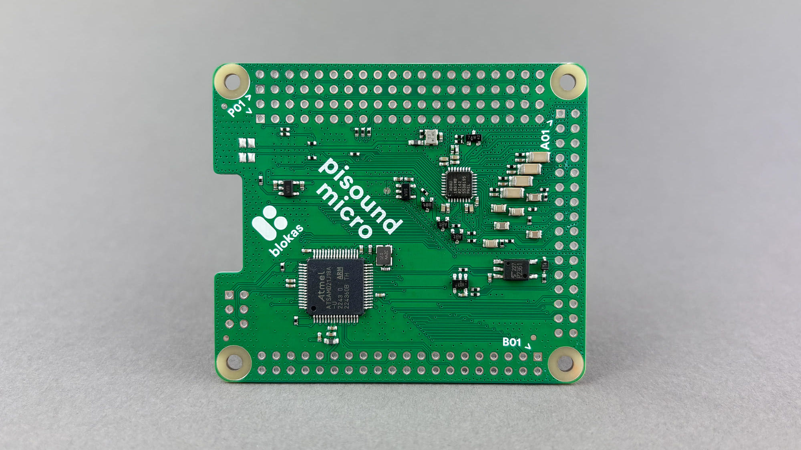
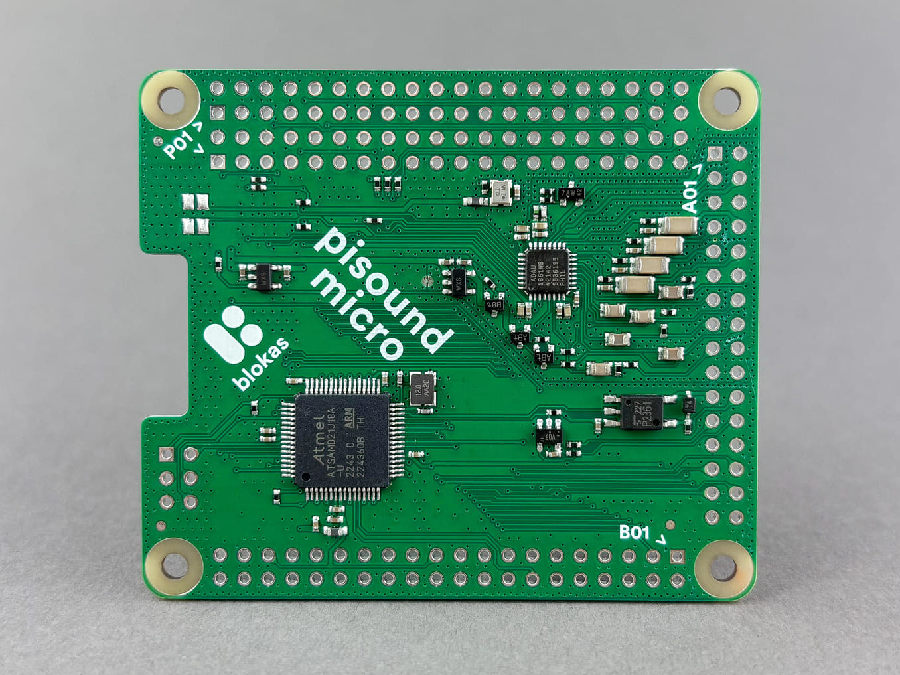

# Pisound Micro

Pisound Micro is a high quality, low latency sound card and MIDI interface with lots of I/O control capabilities for use with Raspberry Pi or compatible Single Board Computers and it is specifically designed to be integrated into your own projects. That means it uses the minimal amount of the 40 pin GPIO header pins, and provides an additional 37 GPIO signals for your use for things like encoders, buttons, potentiometers, LEDs, as well as it comes with no connectors presoldered, giving you the full freedom to lay out your project just like you want it.

## Audio

Pisound Micro provides audio capabilities via the low power ADAU1961 stereo audio codec, capable of 24 bit audio streams from 8kHz to 96kHZ and > 98dB SNR. There's 6 input pins which can be used for differential or single ended input and are mixed and muxed before the ADC. There's also 7 output pins for the stereo DAC - 2 differential channels (2 pins each), 2 single ended channels, as well as a single mono output pin.

## MIDI

The MIDI input and output is provided via 4 dedicated pins (2 for each direction) on a header on Pisound Micro for you to hook up the connector of your choice - either DIN-5 connector, 3.5mm or 2.5mm jack following the MIDI T(R)S standard of your choice.

One or more GPIO pins of Pisound Micro can be assigned to indicate input or output MIDI activity, perfect for connecting LEDs.

## GPIO

There's 37 GPIO signal lines provided by Pisound Micro, all of them can be used for digital input and output, while only some subsets of them are best suited for performing special feats such as reading analog input, others are particularly well suited for interacting with encoders, though encoders could be placed on other pins, they're most snappy on the dedicated ones.

The pin names consist of A or B prefix, indicating which header they are placed on (A or B), and a 2 digit number, which corresponds to the position of the GPIO on the header. For example, A30 is pin number 30 on header A. The header pins are numbered in the same order as [the pins of Raspberry Pi](https://pinout.xyz/){target=_blank}, with the square pin hole indicating the very 1st pin.

Below you'll find a table listing GPIO pin ranges (inclusive) and their functionality:

| Count | Pin Range Start | Pin Range End | GPIO | Encoder | Analog Input |
| ----- | --------------- | ------------- | ---- | ------- | ------------ |
|  6    | A27             | A32           | +    |         |              |
| 16    | B03             | B18           | +    | +       |              |
| 12    | B23             | B34           | +    |         | +            |
|  3    | B37             | B39           | +    |         |              |

## Accessing GPIOs and Controls

There's multiple standardized ways of accessing the GPIOs provided by Pisound Micro. This section here is just an overview of the methods, each of them is covered in more depth in the dedicated pages.

It's not necessary to read through and understand all of them though, you may stick with Pisound Micro Mapper to achieve great things! Each access method is listed from the easiest to use to the more complex ones.

You are not restricted to sticking only to one particular method of use - you can mix and match them as necessary, as long as you're not accessing the same pins in different ways at the same time.

### Pisound Micro Mapper

Pisound Micro Mapper lets you write up a json config to define the connected controls to Pisound Micro's I/O pins and map them to MIDI messages, OSC messages, or directly to ALSA mixer controls such as playback volume. A single control can even be mapped to multiple destinations, and encoder values can also be synced to changes in software, so there's no jumps. See [Pisound Micro Mapper](pisound-micro-mapper.md) for more details.

### libpisoundmicro & Sysfs /sys/pisound-micro

The Pisound Micro kernel module exposes all of the Pisound Micro I/O functionalities, including analog and encoder inputs, through a special location in `/sys/pisound-micro` - as it is all exposed through the sysfs file system, regular file utilities and commands such as `echo` and `cat` can be used for configuring the Pisound Micro, as well as any file system APIs / functionality available in your software / language of choice. See [Sysfs Interface](sysfs-interface.md) for more information.

To make integration to new or existing programs quick and easy, there's `libpisoundmicro`, a C/C++ library with bindings to other languages such as Python, which exposes all the same functionality via a simple-to-use API. See [libpisoundmicro](libpisoundmicro/overview.md) for more information.

### Sysfs /sys/class/gpio

Even though this method is deprecated in favor of /dev/gpiochipN character devices and gpiod / libgpiod since Linux kernel 4.8, anyone who's worked with GPIOs and Linux has come across it. It provides a simple file system tree configurable by file utilities like `echo` and `cat`, as well as file system APIs to manipulate the state of the GPIO pins.

This method only allows using the Pisound Micro pins as digital I/O.

See [Sysfs GPIO](sysfs-gpio.md) for more details on `/sys/class/gpio` usage.

### libgpiod /dev/gpiochipN

The spiritual successor of `/sys/class/gpio` - exposing the digital I/O functionality through a character device at `/dev/gpiochipN` and providing a more flexible way of configuring GPIOs through `ioctl` system calls. Fortunately, there's `gpiod` package as well as `libgpiod` that abstract all the tricky details into a set of utility programs and easy to use C/C++ APIs with bindings to other languages.

This method only allows using the Pisound Micro pins as digital I/O.

Some utilities from `gpiod` of particular interest are `gpiodetect`, `gpioinfo`, `gpioget`, `gpioset` and `gpiomon`. See [gpiod](gpiod-libgpiod.md#gpiod) for more details.
