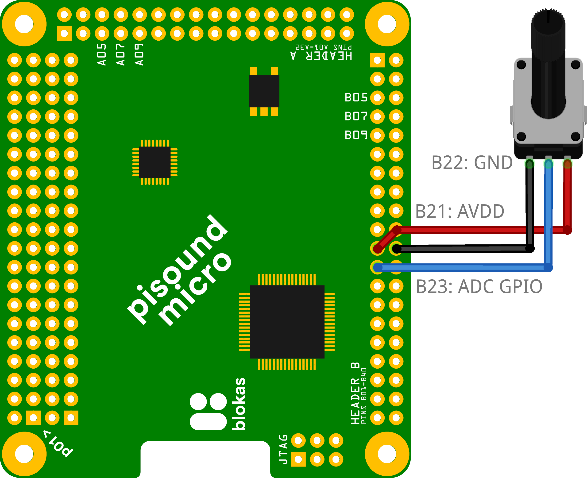

# Pisound Micro Mapper

Pisound Micro Mapper is a program running in the background that takes care of initializing Pisound Micro controls according to the provided configuration file and can also translate them to MIDI, Osc or other common audio software communication means as well as map them to the ALSA mixer controls.

## Install

Assuming that you're using Patchbox OS image, or have set up our [APT server](https://apt.blokas.io/){target=_blank}, run the following command to install:

```bash
sudo apt install -y pisound-micro-mapper
```

## Configuration

The configuration is defined in a json file, by default located at `/etc/pisound-micro-mapper.json`.

Upon modifying the configuration, you must restart the server for changes to take place:

```
sudo systemctl restart pisound-micro-mapper.service
```

Json is a text based format with strict syntax rules, here's a quick [tutorial](https://www.tutorialspoint.com/json/json_syntax.htm){target=_blank} to get you started. Only valid json files are accepted, but there's tools available to help getting them right. For example, there's an online [JSONLint](https://jsonlint.com/){target=_blank} tool which may verify the syntax of your file, or you can use a text editor with built-in validation, such as [Visual Studio Code](https://code.visualstudio.com/){target=_blank} or [Sublime Text](https://www.sublimetext.com/){target=_blank} for editing.

todo: įdėt gal gifą kaip visual studio code pagalba atrodo betypinant

## A Basic Example

Let's dive right in and look at a minimal, but complete, working configuration example:


```json
{
    "$schema": "https://blokas.io/json/pisound-micro-schema.json",
    "version": 1,
    "controls": {
        "pisound-micro": {
            "volume_encoder": {
                "type" : "encoder",
                "pins" : [ "B03", "pull_up", "B04", "pull_up" ]
            }
        },
        "alsa": {
            "hw:micro": [
                "Digital Playback Volume"
            ]
        }
    },
    "mappings" : [
        [ "Digital Playback Volume", "<->", "volume_encoder" ]
    ]
}
```

In the `controls` section, there's one encoder defined, connected to Pisound Micro's pins B03 and B04, as well as an ALSA mixer control of Pisound Micro which we'll want to manipulate. The `mappings` section creates a two way mapping between the controls, so that both of the controls are kept in sync. Whenever the encoder is turned, the ALSA mixer control will change accordingly, as well as whenever the ALSA mixer control gets changed directly, it will be reflected in the encoder's `value` attribute, so value jumps are avoided the next time the encoder is turned.

## Structure

Let's take a look at the bare bones skeleton:

```json
{
    "$schema": "https://blokas.io/json/pisound-micro-schema.json",
    "version": 1,
    "controls": {},
    "mappings": []
}
```

This is the root of the configuration.

* `$schema` defines the JSON Schema to use for validation of data. Advanced editors such as Visual Studio Code or Sublime Text can verify the validity of your config data in real time and also provide suggestions for property names and their possible values.
* `version` is the version of the configuration structure. Should be `1`.
* `controls` is where all of the controls are defined.
* `mappings` is where controls can be tied together to affect one another, it's a key place, if you'd like to assign say an analog potentiometer connected to Pisound Micro to control the playback volume.

### Controls

This section contains control configuration information for a couple of control subsystems, each is defined in further subsections.

The json examples shown here should be assumed to be inside `"controls": {}` object. All of the subsystems are optional, you should configure only the ones you intend to use.

#### Pisound Micro

To gain a good understanding of the possibilities for Pisound Micro controls, first read through the [Sysfs Interface](sysfs-interface.md) which establishes the key concepts.

Each Pisound Micro control is defined as an object within the container `"pisound-micro": {}` object. The keys are the Pisound Micro Element names to use. These names will have to be used in the `mappings` section later on. The `type` property is essential, the remaining set of properties that can be set depend on it.

Here's a quick example on how an Analog Input should be configured:



```json
...
"pisound-micro": {
    "control_name": {
        "type": "analog_in",
        "pin": "B23"
    }
}
...
```

The `control_name` above can be any string of up to 63 bytes in length, as long as it does not contain `/` characters, it is used as the Pisound Micro's Element name, as well as to refer to the control within the `mappings` section.

#### Reference

Here's all of the control properties as well as the enumerations for configuring Pisound Micro controls:

##### Properties

| Property {width=115}| Type | Applicable to Type     | Description                                                       |
| -------------- | --------- | ---------------------- | ----------------------------------------------------------------- |
| `type`         | Type enum | All                    | The type of the control, see below.                               |
| `pin`          | Pin enum  | All, except GPIO Input and Encoder | The pin of the control.                               |
| `pin`          | Array     | GPIO Input             | An array of 2 members - [ pin, pull ].                            |
| `pins`         | Array     | Encoder                | An array of 4 members - [ pin A, pin A pull, pin B, pin B pull. ] |
| `activity`     | Activity enum | Activity           | The activity to monitor.                                          |
| `value`        | Boolean   | GPIO Output            | The initial output value.                                         |
| `mode`         | Mode enum | Encoder                | (Optional) The behavior of the value at the boundary.             |
| `input_min`    | Number    | Analog Input & Encoder | (Optional) The minimum value bound.                               |
| `input_max`    | Number    | Analog Input & Encoder | (Optional) The maximum value bound.                               |
| `value_low`    | Number    | Analog Input & Encoder | (Optional) The lower boundary to linearly rescale to.             |
| `value_high`   | Number    | Analog Input & Encoder | (Optional) The higher boundary to linearly rescale to.            |

##### Type Enum

| Enum Entry {width=115}| Description   |
| --------------------- | ------------- |
| `gpio_input`          | GPIO Input.   |
| `gpio_output`         | GPIO Output.  |
| `activity`            | Activity.     |
| `encoder`             | Encoder.      |
| `analog_in`           | Analog Input. |

##### Pin Enum

| Enum Entry {width=115}| Description                         |
| --------------------- | ----------------------------------- |
| `A27` ... `A32`       | GPIO pin.                           |
| `B03` ... `B18`       | GPIO pin, recommended for Encoders. |
| `B23` ... `B34`       | GPIO pin, can read Analog Input.    |
| `B36` ... `B39`       | GPIO pin.                           |

##### Pull Enum

| Enum Entry {width=115}| Description          |
| --------------------- | -------------------- |
| `pull_none`           | No pull, Hi-Z state. |
| `pull_up`             | Pull up.             |
| `pull_down`           | Pull down.           |

##### Activity Enum

| Enum Entry {width=115}| Description                                                |
| --------------------- | ---------------------------------------------------------- |
| `midi_in`             | Indicate activity on events coming into MIDI Input port.   |
| `midi_out`            | Indicate activity on events based on the MIDI Output port. |

##### Mode Enum

| Enum Entry {width=115}| Description                                                    |
| --------------------- | -------------------------------------------------------------- |
| `clamp`               | (Default) The Encoder's value will stay within the boundaries. |
| `wrap`                | The Encoder's value will wrap around to the other boundary.    |

#### ALSA

The `alsa` object within the `controls` object is used to declare which ALSA mixer controls will be involved in the mappings. To discover the names of the ALSA mixer controls, run the following command:

```bash
amixer -D hw:micro controls
```

It will output all of the control names, in particular, we're interested in the contents of `name='...'`, for example:

```
...
numid=1,iface=MIXER,name='Digital Capture Volume'
numid=2,iface=MIXER,name='Digital Playback Volume'
...
```

To bring these controls into Pisound Micro Mapper's attention, they can be declared like this:

```json
...
"alsa": {
    "hw:micro": [
        "Digital Playback Volume",
        ["Digital Capture Volume", { "alias": "rec_vol" } ]
    ]
}
...
```

The above example demonstrates the 2 possible ways of listing the ALSA mixer controls - the first way is using the control name verbatim. The 2nd way lets you define an alias for the mixer control name. As you're allowed to involve other ALSA cards as well by placing them within the `alsa` object, control name conflicts may arise, thus aliases can be used to circumvent the name conflicts.

#### MIDI

One or more virtual ALSA sequencer MIDI ports can be configured to be mapped to/from the other controls.

Refer to [Summary of MIDI 1.0 Messages](https://www.midi.org/specifications-old/item/table-1-summary-of-midi-message){target=_blank} for a quick overview of the MIDI messages.

Consider the following example, within the `controls` object:

```json
...
"midi": {
    "my_port": {
        "controls": {
            "fader": { "type": "control_change", "channel": 1, "id": 3 },
            "pad": { "type": "note_on", "channel": 1, "id": 60 }
        }
    }
}
...
```

`my_port` is the ALSA sequencer port name to use, it can be referred to from other software or CLI commands, for example, running `aconnect -l` would output:

```bash
...
client 130: 'my_port' [type=user,pid=14584]
    0 'my_port         '
...
```

You may then refer to this port either by `130:0` or `my_port:0` when configuring other software.

The MIDI messages that this port should listen to and produce must be listed in the `controls` sub-object, just like in the above example. It should contain an object for each control, the keys are the control name which will be used later on in the `mappings` section.

Each control must have a `type` property. Based on the type, some controls must also have `id` (number between 0-127) and/or `channel` (number, 1-16) properties. See the below table for the possible `type` values:

| Type    {width=148}| Channel? | Id? | Description           |
| ------------------ | -------- | --- | --------------------- |
| `note`             | Y        | Y   | Note On and Note Off  |
| `note_on`          | Y        | Y   | Note On               |
| `note_off`         | Y        | Y   | Note Off              |
| `control_change`   | Y        | Y   | Control Change        |
| `program_change`   | Y        | Y   | Program Change        |
| `poly_aftertouch`  | Y        | Y   | Polyphonic Aftertouch |
| `pitch_bend`       | Y        |     | Pitch Bend            |
| `channel_pressure` | Y        |     | Channel Pressure      |
| `start`            |          |     | Start                 |
| `continue`         |          |     | Continue              |
| `stop`             |          |     | Stop                  |
| `reset`            |          |     | Reset                 |

<sup>*Y marks whether Channel or Id are required properties for the type.</sup>

The Midi Note Numbers should be expressed as integer numbers. There's some differing standards on which note is the 'Middle C', usually it's the note 60, but occasionally it can be one octave higher (+12 semitones (72)) or lower (-12 semitones (48)), in case of issues matching up the number to external MIDI controllers, use MIDI monitoring software such as [`aseqdump`](https://linux.die.net/man/1/aseqdump){target=_blank} or refer to you controller's manual.

#### OSC

[Open Sound Control](http://opensoundcontrol.org){target=_blank} messaging can be used as well. Consider this example, assume it's within the `controls` object:

```json
...
"osc": {
    "my_synth": {
        "listen": "osc.udp://:9000",
        "notify": [ "osc.udp://:9001", "osc.udp://:9002" ],
        "params": {
            "cutoff_freq0": {
                "path": "/filter/0/cutoff_freq",
                "type": "f",
                "low": 0.0,
                "high": 20000.0
            },
            "waveform0": {
                "path": "/oscillator/0/waveform",
                "type": "i",
                "low": 0,
                "high": 7
            },
            "rec_vol_right": {
                "path": "/alsa/1/rec_volume",
                "type": "f"
            }
        }
    }
}
...
```

`my_synth` is an arbitrary name, you can set it to anything that's meaningful to you. The object defines a port to listen to for changes, as well as which other OSC destinations should be notified of changes. The `params` object contains the OSC parameter definitions, the `type` and `path` properties are required, `low` and `high` are optional and default to `0.0` and `1.0` for floating point type (`f`) or `0` and `1023` for integer type (`i`). The names will be used to refer to from the `mapping` section later on.

##### Reference

###### Control Server Properties

| Property {width=115}| Type                                    | Description                                             |
| ------------------- | --------------------------------------- | ------------------------------------------------------- |
| `listen`            | Address                                 | (Optional) The listen address.                          |
| `notify`            | Address or an array of addresses        | (Optional) The destination(s) to send notifications to. |
| `params`            | Object containing Parameter sub-objects | The Parameters.                                         |

###### Address

An Address is a liblo URL string, consisting of protocol (udp or tcp), IP and port number, some examples:

* `osc.udp://:9000` - localhost, UDP port 9000.
* `osc.tcp://:9000` - localhost, TCP port 9000.
* `osc.udp://192.168.1.123:5678` - Another device in local network with IP 192.168.1.123, UDP port 5678.

###### Parameter Properties

| Property {width=115}| Type                                    | Description                                             |
| ------------------- | --------------------------------------- | ------------------------------------------------------- |
| `path`              | string                                  | The Osc path to use for this parameter.                 |
| `type`              | `i` for Integer, `f` for Float          | The destination(s) to send notifications to.            |
| `low`               | number                                  | (Optional) The low boundary.                            |
| `high`              | number                                  | (Optional) The high boundary.                           |

### Mappings

The mappings between all the controls defined in the `controls` section go into the `mappings` section - it's an array of Mapping values, which hold the relation info between the controls. The mappings can be unidirectional for one way control or bidirectional to keep both controls in sync with one another.

Here's some example mappings, reusing control names defined in previous examples:

```json
...
"mappings": [
    [ "Digital Playback Volume", "<->", "volume_encoder" ],
    [ "rec_vol", "<-", "rec_vol_right", { "chan_a": 1 } ]
]
...
```

The first mapping is a bidirectional mapping between ALSA mixer's `Digital Playback Volume` and Pisound Micro `volume_encoder` control. The ALSA mixer controls are stereo, such mappings by default assign both channels to the single control. The 2nd mapping is a one directional mapping from osc's `rec_vol_right` control to ALSA mixer's `Digital Capture Volume`, referred to via the `rec_vol` alias, this mapping will affect only the right channel.

#### Mapping Type

The Mapping type is an array of either 3 or 4 members:

| Member | Name      | Type           | Description                                    |
| ------ | --------- | -------------- | ---------------------------------------------- |
| 1st    | Control A | string         | The name of the first control.                 |
| 2nd    | Direction | Direction enum | The mapping direction.                         |
| 3rd    | Control B | string         | The name of the second control.                |
| 4th    | Options   | Options object | (Optional) Additional options for the mapping. |

#### Direction Enum

| Enum Entry {width=115}| Description             |
| --------------------- | ----------------------- |
| `->`                  | Map from A to B.        |
| `<-`                  | Map from B to A.        |
| `<->`                 | Map in both directions. |

A mapping "from A to B" means that whenever you move the A control, the B control will get adjusted accordingly.

#### Options Object

| Property   {width=115}| Description                                                         |
| --------------------- | ------------------------------------------------------------------- |
| `chan_a`              | (Optional) The channel to use for control A, default is to use all. |
| `chan_b`              | (Optional) The channel to use for control B, default is to use all. |
