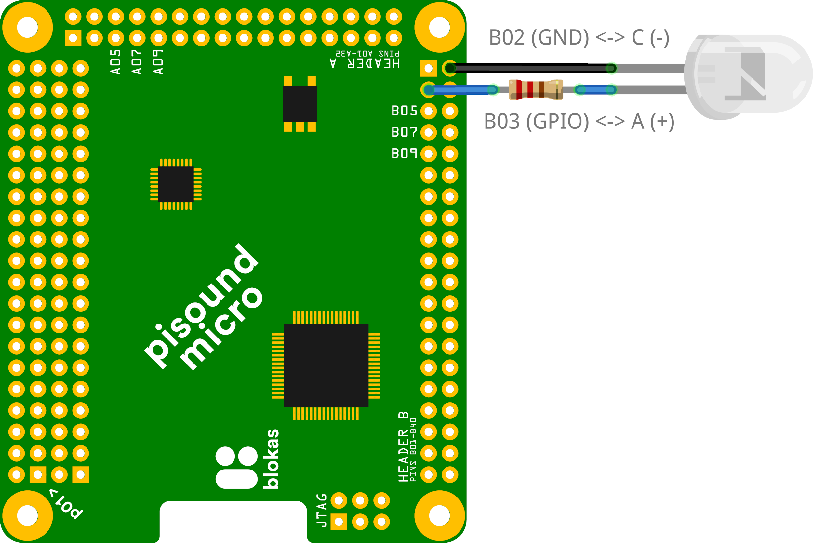
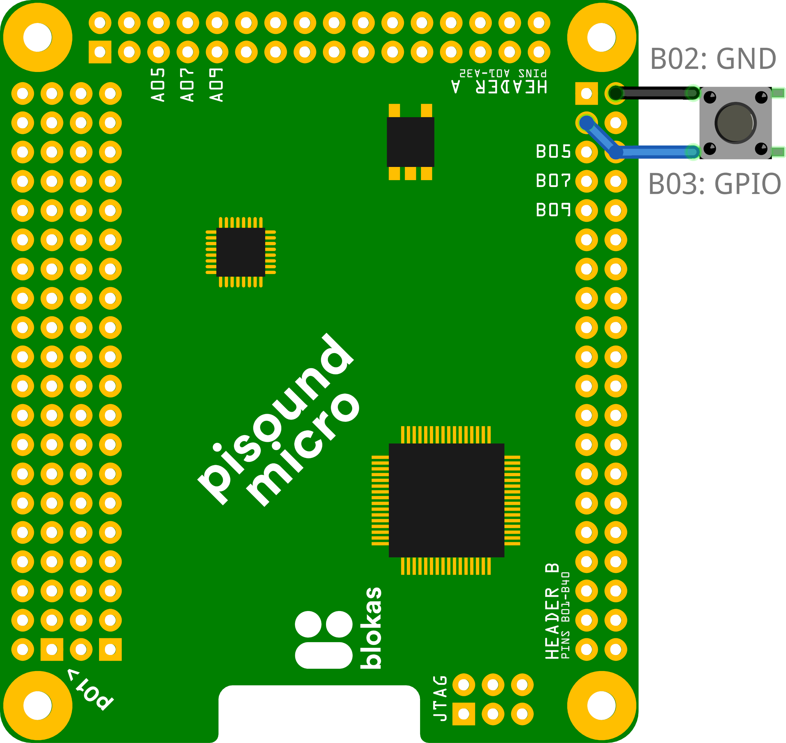
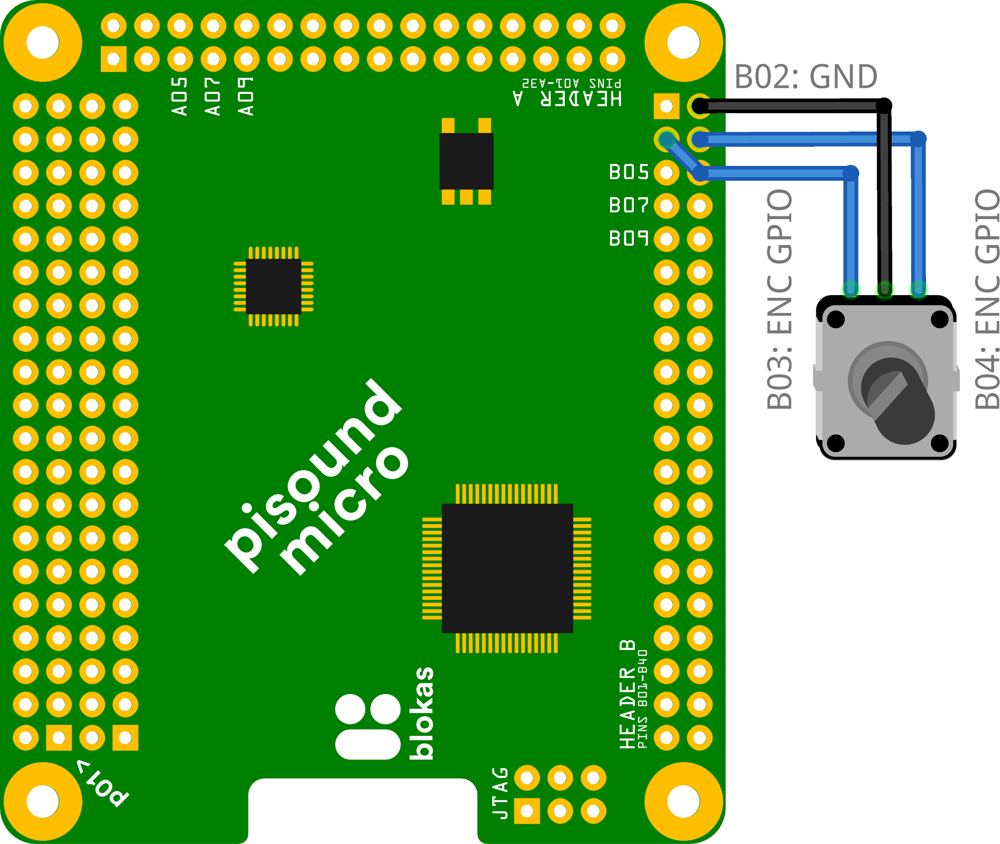
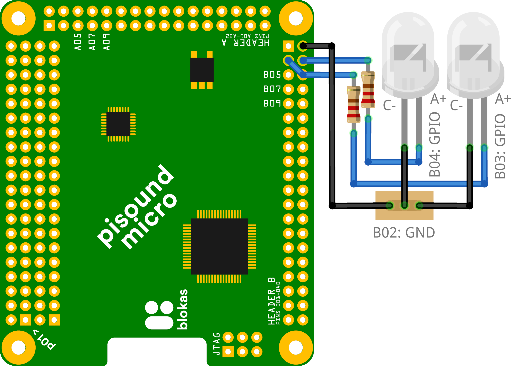

# Sysfs Interface

All of the GPIO I/O functionality of Pisound Micro is accessed through the sysfs `/sys/pisound-micro` tree. It is based around a concept of creating named Elements and assigning them to perform certain functions on the specified GPIO pins. An Element can be a digital I/O control, analog potentiometer, digital encoder or MIDI activity output.

Once an Element is created, it gets its own subdirectory under `/sys/pisound-micro/elements/` and provides a couple of files for reading & writing the value, as well as further configuration, like setting the minimum and maximum values.

This page details interacting with the sysfs interface directly and provides a complete reference on the I/O functionalities of Pisound Micro. There's [libpisoundmicro](libpisoundmicro.md), a library encapsulating all of the available functionality of the sysfs interface in a straightforward C/C++ API with bindings to other languages and should be the preferred method for integrating Pisound Micro I/O functions into your own projects, whenever possible.

The first part goes through the practical examples of setting up various kinds of Elements, while the 2nd part is a complete Reference of the sysfs interface.

## Sysfs /sys/pisound-micro interface

### Quick Start

Before you start, please make sure you have our `pollgpio` (todo: link to GitHub source code) utility installed:

```bash
sudo apt install -y pollgpio
```

#### Digital Output

First let's get acquainted by going through some quick examples. Let's hook up an LED to Pisound Micro's pin B03, connect a single color LED's anode (+) through a series resistor (usually with values between 200 Ohm and 1k Ohm, depending on your specific LED, like color, refer to its datasheet) to GPIO pin B03, and the cathode (-) to pin B02 (GND).



Then we can manually turn it on and off:

```bash
# First create a GPIO output Element named 'my_led',
# controlling pin B03 and initially setting it to low output.
echo my_led gpio B03 output 0 > /sys/pisound-micro/setup

# As both of the LED's pins are at ground voltage, no current is flowing
# and the LED is off.

# Now let's make it light up by setting the GPIO high:
echo 1 > /sys/pisound-micro/elements/my_led/value

# The LED should be lit up now. Let's turn it off again:
echo 0 > /sys/pisound-micro/elements/my_led/value

# Let's release the 'my_led' Element now, so the B03 pin can be used
# for other purposes.
echo my_led > /sys/pisound-micro/unsetup
```

An exercise for the reader - write a bash script to blink the LED on and off again every one second. Use a `for` or `while` loop to keep the script running and `sleep 0.5` to delay execution between state changes.

After you're done, disconnect the LED and the resistor.

#### Digital Input

Similarly, you may read the on and off state of any of the GPIO lines of Pisound Micro. Hook up a momentary or toggle/slide switch to pin B03 and the other side of the switch to GND (pin B02) or just connect one end of a jumper cable to pin B03 and be prepared to short the other end to GND to see different input states.



Here's how to read Digital Input:

```bash
# Let's create a GPIO input Element named 'switch',
# with internal pull up resistor enabled:
echo switch gpio B03 input pull_up > /sys/pisound-micro/setup

# Let's read the value:
cat /sys/pisound-micro/elements/switch/value

# You'll see it output 1, if the circuit is open,
# and 0 if pin B03 is shorted to GND.
# Feel free to rerun the above cat command.

# This time let's use our `pollgpio` utility to monitor
# the value as it changes.
pollgpio /sys/pisound-micro/elements/switch/value

# Now close or open the circuit on B03 and you should see the latest
# value printed in a new line every time it changes.

# Finally let's release the 'switch' Element now, so the pin B03
# can be used for other purposes.

# Hit Ctrl+C to stop pollgpio, then:
echo switch > /sys/pisound-micro/unsetup
```

#### Analog Input / Potentiometer

By now a pattern should have emerged - to get analog readings between 0V (GND) and 3.3V (AVDD), you have to set up an `analog_in` typed Element, using a pin with analog reading functionality. It provides 10 bit resolution - values between 0 and 1023. Additionally, for convenience, it's possible to limit the input range to certain values if you're not interested in the entire range using `input_min` and `input_max` sysfs attributes, as well as remap the output value range to values that fit your application, including reversing the polarity, using `value_low` and `value_high` sysfs attributes. Here's a quick example project - take any 3 pin single channel potentiometer you have, connect its 1st pin to GND, the 2nd to pin B23 and the 3rd to AVDD.


A classic voltage divider circuit. Then:

```bash
# Let's create an analog_in Element named 'pot' on pin B23:
echo pot analog_in B23 > /sys/pisound-micro/setup

# Now let's monitor its value:
pollgpio /sys/pisound-micro/elements/pot/value

# It should immediately print out the current value,
# try rotating the shaft to see the values change.

# Keep pollgpio running in this terminal to see changes
# in real time, and start another session in another terminal
# window for the rest of the commands.

# Let's say we're not satisfied with the change direction.
# Not so quick! There's no need to physically swap pins 1
# and 3, we can change the direction simply by reconfiguring
# the value_low and value_high attributes:
echo 1023 > /sys/pisound-micro/elements/pot/value_low
echo 0 > /sys/pisound-micro/elements/pot/value_high

# Now let's say for one reason or another we're only interested in
# the first half of voltage value range (0V ~ 1.65V), we want any
# value higher than 1.65V to be clamped to maximum. We can get such
# readings by adjusting the input_min and input_max attributes:
echo 0 > /sys/pisound-micro/elements/pot/input_min
echo 511 > /sys/pisound-micro/elements/pot/input_max

# Now, when the pot is within the top half, you should be getting value
# 1023, and values between 0 and 1023 for the bottom half. The 0-511 range
# gets scaled to 0 - 1023 range. To make it map directly to the values you
# used to get just previously, we should change 1023 of value_low to 511:
echo 511 > /sys/pisound-micro/elements/pot/value_low

# Let's stop pollgpio in the original terminal and release the Element:
# Hit Ctrl+C while the pollgpio terminal is active and execute:
echo pot > /sys/pisound-micro/unsetup
```

#### Encoder

Quadrature encoders are handled similarly to analog inputs described above, they do have one more attribute though - `value_mode`, which configures what happens when the highest or lowest value is reached - should it stay there, or wrap to the other end. The encoders are best placed on pins between B03 and B18. Let's give it a spin - hook up a quadrature encoder's 1st pin to B03, the 2nd pin to GND and the 3rd pin to B04, then:



```bash
# Let's setup 'enc' Element on pins B03 and B04 with internal pull-ups
# enabled:
echo enc encoder B03 pull_up B04 pull_up > /sys/pisound-micro/setup

# Now start monitoring the value:
pollgpio /sys/pisound-micro/elements/enc/value

# You should first see 0, spinning it one direction should increase
# the values, the other direction should decrease the values, but
# it shouldn't go below 0 (default minimum) or above 23 (default maximum),
# as the default value_mode is to clamp the values. Let's give wrap mode
# a try, in another terminal
# session, do:
echo wrap > /sys/pisound-micro/elements/enc/value_mode

# Now spinning below 0 should wrap over to 23, spinning above 23
# should wrap over to 0.

# A nice feature of encoders is that it updates the values in relative
# manner to the previous value, instead of being an absolute control
# like potentiometers. This enables for smooth value transitions when
# a value is changed externally using some other control method, like a UI
# control and a mouse, the encoder can be kept up to date by writting to
# its value attribute. Try this:

echo 17 > /sys/pisound-micro/elements/enc/value

# Now twist one way or the other, you should see the value change without
# any jumps to either to 16  or 18, regardless of what value was set prior
# to our explicit value change using the above command.

# As encoders only produce usually between 12 or 24 value changes in 360
# degree turns, it can be convenient to expand its output value range to
# something larger:

echo 1023 > /sys/pisound-micro/elements/enc/value_high

# Now there should be changes in steps of ~43, and the maximum value should
# be 1023.

# There's 2 ways to change the polarity of the encoder - either, just like
# with analog input, swap the value_high and value_low, or re-setup with
# the pins swapped places.

# Method 1:
echo 0 > /sys/pisound-micro/elements/enc/value_high
echo 1023 > /sys/pisound-micro/elements/enc/value_low

# Method 2, first unsetup the encoder, then set it up again differently:
echo enc > /sys/pisound-micro/unsetup
echo enc encoder B04 pull_up B03 pull_up > /sys/pisound-micro/setup

# Note that there's no event produced by the kernel telling that the
# file monitored by pollgpio has disappeared, it will get stuck with no
# further changes detected. It has to be restarted, by doing Ctrl+C and
# starting it again:
pollgpio /sys/pisound-micro/elements/enc/value

# Finally finish up by hitting Ctrl+C and releasing the 'enc' Element:
echo enc > /sys/pisound-micro/unsetup
```

#### MIDI Activity LED

This is a simple automatic output Element, indicating activity on either MIDI input or output events. First, connect two single color LEDs, one using signal line B03, the other B04, in the following way - the LED's cathode (-) should be connected to GND (pin B02), and the anode (+) pins should be connected to one of aforementioned GPIO lines, each through a series resistor (usually with values between 200 Ohm and 1k Ohm, depending on your specific LED, like color, refer to its datasheet).



Then set them up:

```bash
echo act_in activity_midi_in B03 > /sys/pisound-micro/setup
echo act_out activity_midi_out B04 > /sys/pisound-micro/setup
```

To see MIDI output activity on pin B04, send some events:

```bash
amidi -p hw:pisound-micro -S "90 40 30"
```

To observe MIDI input, either have a MIDI connector hooked up to the MIDI input pins and send it some data using external MIDI devices, or if there's no connector hooked up, you may temporarily short two pairs of pins A21 with A24 and A23 with A22, then produce MIDI output using the `amidi` command above, the produced data should be sent to Pisound Micro's input and should have the activity indicated on the LED connected to B03.

Finally unsetup the elements:

```bash
echo act_in > /sys/pisound-micro/unsetup
echo act_out > /sys/pisound-micro/unsetup
```

### Reference

#### Types

There's a couple of types in use in the sysfs interface, the further sections will refer to this table:

| Type Name {width="15%"}| Values {width="15%}| Description |
| --------- | ---------- | ------ |
| `name`    | Text characters | The maximum length in bytes is 63, the '`/`' character is not allowed. |
| `pin`     | `A27` - `A32`, `B03` - `B18`, `B23` - `B34`, `B37` - `B39` | The GPIO pin on one of Pisound Micro's extension headers, consisting of 3 symbols - A or B letter, indicating which Pisound Micro header it refers to, and 2 digit decimal number, indicating the pin position on the header. |
| `pull`    | `pull_up`, `pull_down`, `pull_none` | The GPIO pin pull type, either pulling up to +3.3V, down to GND or pull resistor is disabled entirely. |
| `dir`     | `input`, `output` | The GPIO pin direction. |
| `bool`    | `y`, `1`, `on` for True<br>`n`, `0`, `off` for False | True (High) or False (Low). |
| `int`     | A number between -2147483648 and 2147483647 | A 32 bit integer number, used for value and its high and low range boundaries. It can be expressed in base of decimal, hexadecimal (if prefixed by `0x`) or octal (`0` prefix). |
| `element` | `gpio`, `analog_in`, `encoder`, `activity_led` | The element type. |
| `activity` | `activity_midi_input`, `activity_midi_output` | Activity kinds. |
| `value_mode` | `clamp`, `wrap` | The behavior of a value of an encoder, whether it stays at lowest or highest value (`clamp`) or wraps over to the other end (`wrap`). |

#### /sys/pisound-micro/setup

The write-only `setup` sysfs file is for setting up new Pisound Micro Elements. The file expects a single line to be written to it with the description of an Element you want created. If writing succeeds (return/exit code is 0), a new Element with the given name appears under `/sys/pisound-micro/elements/` tree, otherwise, an error code is returned. `errno` from `moreutils` can be used to get hints of what went wrong. For example, `EINVAL` error code indicates that there was something wrong with the request, like syntax error, typo, non-existent pin, unsupported function on the provided pin, etc... `EBUSY` indicates, that the pin is already in use either as an Element, or already used by `/sys/class/gpio` interface or `libgpiod`. `EEXIST` indicates, that there's already an Element with the provided name, but set up differently. Trying to setup an already existing element with the exactly the same configuration shall succeed.

The below sections list all the possible `setup` requests that can be written into `/sys/pisound-micro/setup`. The text enclosed in `<` and `>` brackets refer to required types defined in the above table and should be replaced by one of the possible values, the brackets themselves are not needed in the actual command. Lines that start with `#` indicate a comment.

##### Digital Output

```
# Name    Type  Pin    Direction  Output Value
  <name>  gpio  <pin>  output     <bool>

# Example:
# echo signal gpio B03 output 1 > /sys/pisound-micro/setup
#
# Sets up a digital output Element named 'signal'
# on pin B03 and sets initial output to high.
```

##### Digital Input

```
# Name    Type  Pin    Direction  Pull
  <name>  gpio  <pin>  input      <pull>

# Example:
# echo button gpio B03 input pull_up > /sys/pisound-micro/setup
#
# Sets up a digital input Element named 'button'
# on pin B03 with pull-up to +3.3V enabled.
```

##### Analog Input

```
# Name    Type       Pin
  <name>  analog_in  <pin>

# Example:
# echo pot gpio B23 > /sys/pisound-micro/setup
#
# Sets up an analog input Element named 'pot'
# on pin B23.
```

##### Encoder Input

```
# Name    Type     Pin A  Pull A  Pin B  Pull B
  <name>  encoder  <pin>  <pull>  <pin>  <pull>

# Example:
# echo enc encoder B03 pull_up B04 pull_up > /sys/pisound-micro/setup
#
# Sets up an encoder input Element named 'enc'
# on pins B03 and B04 with pull-ups to +3.3V enabled.
```

##### Activity Output

```
# Name    Type      Pin    Activity
  <name>  activity  <pin>  <activity>

# Example:
# echo led activity B03 activity_midi_input > /sys/pisound-micro/setup
#
# Sets up an activity monitor Element named 'led'
# on pin B03.
```

#### /sys/pisound-micro/unsetup

The write-only `unsetup` sysfs file is for releasing the Pisound Micro Elements. Once an Element is released, the pins used by it go back to the default Hi-Z state.

The only content of `unsetup` request should be the target Element's name, the exact same value that was used during the `setup`. If it succeeds, the 0 (success) code is returned. If there was an error, `errno` from `moreutils` can be used to make sense of it. For example, you may get a `ENOENT` error if the Element with the specified name was not found.

```
<name>

# Example:
# echo led > /sys/pisound-micro/unsetup
#
# Unsetups the 'led' Element, as previously
# set up in the Activity Output example.
```

#### /sys/pisound-micro/elements/*

The Elements tree contains all the successfully set up Elements and gives access to their attributes. Encoder and Analog Inputs provide additional attributes to customize the controls such as the input and value ranges. All of the Element's attributes are described below:

| Attribute {width="17%"}| R/W | Applies to | Description |
| --------------- | --- | ---------- | ----------- |
| `type`          | R   | All        | Contains the read only type string of the Element. |
| `value`         | R/W | All, except Activity Elements | The current value of the Element. If it's an output element, such as a digital output, writing to this attribute is used to change the output level. It can also be useful to update the value of an Encoder Element from your software, to keep external changes that can occur in sync, to avoid skips and jumps when the Encoder is manipulated. |
| `pin`           | R   | All        | The pin used by the Element |
| `pin_name`      | R   | All        | The name of the pin used by the Element |
| `pin_b`         | R   | Encoder    | The 2nd pin used by the Encoder. |
| `pin_b_name`    | R   | Encoder    | The name of the 2nd pin used by the Encoder. |
| `activity_type` | R   | Activity   | The type of activity being monitored. |
| `input_min`     | R/W | Encoder & Analog Input | See below section. |
| `input_max`     | R/W | Encoder & Analog Input | See below section. |
| `value_low`     | R/W | Encoder & Analog Input | See below section. |
| `value_high`    | R/W | Encoder & Analog Input | See below section. |
| `value_mode`    | R/W | Encoder    | See below section. |
| `direction`     | R   | GPIO       | The direction of the GPIO Element. |
| `gpio_export`   | W   | GPIO       | Writing anything into this attribute exports its equivalent through `/sys/class/gpio`. |
| `gpio_unexport` | W   | GPIO       | Writing anything into this attribute unexports its equivalent in `/sys/class/gpio`. |

#### Encoder and Analog Input Values

Encoders and Analog Inputs both have an internal raw value they keep track of, which undergoes 2 stages of transformation to reach the final `value`. The `input_min` and `input_max` range together with `value_mode` define how the internal raw value of an Analog Input (which is between 0 and 1023) or Encoder (incremented or decremented by 1 from previous raw value) is treated. The `value_mode` for Analog Inputs is implicitly `clamp` and can't be changed. For Encoders, you may select `clamp` (default) which limits and does not allow the value to roll over to the other side if it reaches either the `input_min` or `input_max`, or `wrap` which automatically sets the value to the other input range boundary once it goes outside of range.

Once the raw value is clamped or wrapped over, the resulting `value` is linearly mapped into the `value_low` and `value_high` range from [`input_min`;`input_max`] range.

Some pseudo code is in order to help understand exactly how the `value` attribute gets calculated:

```js
var v; // A temporary variable.
if (value_mode == "wrap") {
    v = ((raw_value - input_min) % (input_max - input_min)) + input_min;
} else {
    // Can be nothing else but "clamp".
    v = min(max(raw_value, input_min), input_max);
}
// Linearly transform 'input' range to 'value' range.
value = ((v - input_min) * (value_high - value_low))
        / (input_max - input_min) + value_min;
```

As the name implies, `input_min` must be <= `input_max` - this condition is ensured at all times, implicitly swapping the `input_min` and `input_max` as they are stored if needed.

On the other hand, `value_low` and `value_high` range boundaries don't have to follow the same rule, therefore, it is possible to invert the polarity of a control if `value_low` is > `value_high`.

Modifying the value ranges will automatically adjust the internal raw value and `value` attribute accordingly.
